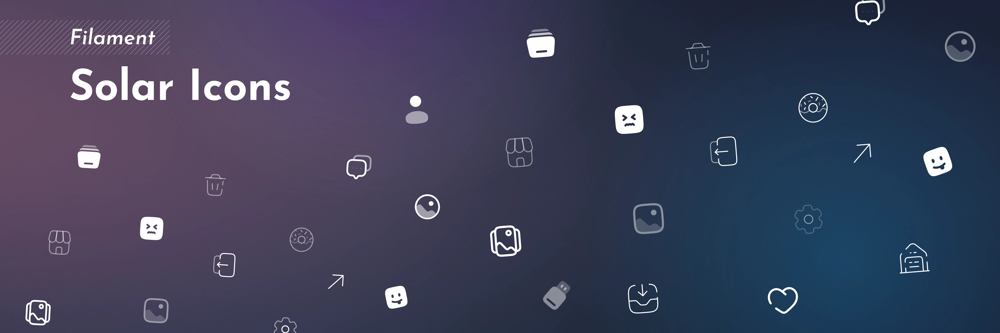

# Filament Solar Icons

A Solar icon set implementation for Filament 4.x, providing the full set of Solar icons integrated with Filament's interface.

> [!IMPORTANT]
> The Solar icon set by [480 Design](https://github.com/480-Design/Solar-Icon-Set) is licensed under [CC BY 4.0](https://creativecommons.org/licenses/by/4.0/). See [Icon License](#icon-license) section below for attribution requirements.

## Index

<pre>
<a href="#installation"
>> Installation..................................................................... </a>
<a href="#icon-styles"
>> Icon Styles...................................................................... </a>
<a href="#using-icons-in-custom-enums"
>> Using Icons in Custom Enums...................................................... </a>
<a href="#custom-enum-with-icons"
  >> Custom Enum with Icons......................................................... </a>
<a href="#available-icon-style-enums"
  >> Available Icon Style Enums..................................................... </a>
<a href="#example-table-column-with-custom-icons"
  >> Example: Table Column with Custom Icons........................................ </a>
<a href="#example-form-field-with-icon"
  >> Example: Form Field with Icon.................................................. </a>
<a href="#mixing-icon-styles"
  >> Mixing Icon Styles............................................................. </a>
<a href="#override-specific-icons"
>> Override Specific Icons.......................................................... </a>
<a href="#override-icon-aliases"
  >> Override Icon Aliases.......................................................... </a>
<a href="#override-individual-icons"
  >> Override Individual Icons...................................................... </a>
<a href="#override-styles-for-specific-aliases"
  >> Override Styles for Specific Aliases........................................... </a>
<a href="#override-styles-for-specific-icons"
  >> Override Styles for Specific Icons............................................. </a>
<a href="#icon-license"
>> Icon License..................................................................... </a>
<a href="#cc-by-40-requirements"
  >> CC BY 4.0 Requirements......................................................... </a>
<a href="#credits"
>> Credits.......................................................................... </a>
<a href="#license"
>> License.......................................................................... </a>
</pre>

## Installation

Install via Composer:

```bash
composer require g4b0rdev/filament-solar-icons
```

Register the plugin in your Filament Panel provider:

```php
use G4b0rDev\Icons\Solar\SolarIcons;

public function panel(Panel $panel): Panel
{
    return $panel
        ->plugin(SolarIcons::make());
}
```

## Icon Styles

Solar icons come in **seven styles**: `bold`, `broken`, `duotone`, `linear`, `outline`, `bold-duotone`, and `line-duotone`.

By default, the package uses the `outline` style. You can change the global style:

```php
SolarIcons::make()
    ->style('bold');
```

## Using Icons in Custom Enums

When you need to use Solar icons in custom enums or other contexts where you need the full icon name with the `solar-` prefix, use the `getIconName()` method.
This is particularly useful for Filament's `HasIcon` interface.

### Custom Enum with Icons

Example for enum:

```php
<?php

declare(strict_types=1);

use Filament\Support\Contracts\HasColor;
use Filament\Support\Contracts\HasIcon;
use G4b0rDev\Icons\Solar\Enums\SolarLineDuotone;

enum Status: string implements HasColor, HasIcon
{
    case DRAFT = 'draft';
    case PUBLISHED = 'published';
    case ARCHIVED = 'archived';

    public function getIcon(): string
    {
        return match ($this) {
            self::DRAFT => SolarLineDuotone::Pen->getIconName(),
            self::PUBLISHED => SolarLineDuotone::CheckRead->getIconName(),
            self::ARCHIVED => SolarLineDuotone::Box->getIconName(),
        };
    }

    public function getColor(): string
    {
        return match ($this) {
            self::DRAFT => 'secondary',
            self::PUBLISHED => 'success',
            self::ARCHIVED => 'danger',
        };
    }
}
```

### Available Icon Style Enums

All seven icon styles have corresponding enums with the `getIconName()` method:

- `SolarBold` - Bold style icons
- `SolarBroken` - Broken style icons
- `SolarLinear` - Linear style icons
- `SolarOutline` - Outline style icons
- `SolarBoldDuotone` - Bold duotone style icons
- `SolarLineDuotone` - Line duotone style icons

### Example: Table Column with Custom Icons

```php
use Filament\Tables\Columns\TextColumn;
use G4b0rDev\Icons\Solar\Enums\SolarBold;

TextColumn::make('status')
    ->badge()
    ->icon(fn (string $state): string => match ($state) {
        'active' => SolarBold::CheckCircle->getIconName(),
        'inactive' => SolarBold::CloseCircle->getIconName(),
        'pending' => SolarBold::ClockCircle->getIconName(),
        default => SolarBold::QuestionCircle->getIconName(),
    })
```

### Example: Form Field with Icon

```php
use Filament\Forms\Components\TextInput;
use G4b0rDev\Icons\Solar\Enums\SolarOutline;

TextInput::make('email')
    ->email()
    ->prefixIcon(SolarOutline::Letter->getIconName())
```

### Mixing Icon Styles

You can mix different icon styles in the same component:

```php
enum Priority: string implements HasIcon
{
    case HIGH = 'high';
    case MEDIUM = 'medium';
    case LOW = 'low';

    public function getIcon(): string
    {
        return match ($this) {
            self::HIGH => SolarBold::DangerTriangle->getIconName(),
            self::MEDIUM => SolarOutline::InfoCircle->getIconName(),
            self::LOW => SolarLinear::CheckCircle->getIconName(),
        };
    }
}
```

## Override Specific Icons

### Override Icon Aliases

```php
SolarIcons::make()
    ->overrideAlias(PanelsIconAlias::SIDEBAR_EXPAND_BUTTON, SolarBold::AltArrowRight)
    ->overrideAlias(TablesIconAlias::SEARCH_FIELD, SolarOutline::Magnifer);
```

Or override multiple aliases:

```php
SolarIcons::make()
    ->overrideAliases([
        PanelsIconAlias::SIDEBAR_EXPAND_BUTTON => SolarBold::AltArrowRight,
        TablesIconAlias::SEARCH_FIELD => SolarOutline::Magnifer,
        ActionsIconAlias::CREATE_ACTION_GROUPED => SolarBold::AddCircle,
    ]);
```

### Override Individual Icons

```php
SolarIcons::make()
    ->overrideIcon(SolarOutline::MinimalisticMagnifer, SolarBold::Magnifer)
    ->overrideIcon(SolarOutline::AddCircle, SolarBold::AddSquare);
```

Or override multiple icons:

```php
SolarIcons::make()
    ->overrideIcons([
        SolarOutline::MinimalisticMagnifer->value => SolarOutline::Magnifer,
        SolarOutline::AddCircle->value => SolarOutline::AddSquare,
        SolarOutline::Pen->value => SolarOutline::PenNewSquare,
    ]);
```

### Override Styles for Specific Aliases

```php
SolarIcons::make()
    ->style('outline')
    ->overrideStyleForAlias(PanelsIconAlias::SIDEBAR_EXPAND_BUTTON, 'bold')
    ->overrideStyleForAlias([
        TablesIconAlias::SEARCH_FIELD,
        TablesIconAlias::ACTIONS_FILTER,
    ], 'broken');
```

### Override Styles for Specific Icons

```php
SolarIcons::make()
    ->style('outline')
    ->overrideStyleForIcon(SolarOutline::Magnifer, 'bold')
    ->overrideStyleForIcon([
        SolarOutline::Home,
        SolarOutline::User,
    ], 'broken');
```

## Icon License

**Important**: The Solar icon set by [480 Design](https://github.com/480-Design/Solar-Icon-Set) is licensed under [CC BY 4.0](https://creativecommons.org/licenses/by/4.0/).

### CC BY 4.0 Requirements

When using Solar icons, you must:

1. **Give appropriate credit** to 480 Design
2. **Provide a link to the license**: https://creativecommons.org/licenses/by/4.0/
3. **Indicate if changes were made** to the icons (if applicable)

You may satisfy the attribution requirement by including a notice in your application's credits, about page, or documentation. Example:

```
Icons by Solar Icon Set (480 Design) - CC BY 4.0
https://github.com/480-Design/Solar-Icon-Set
```

## Credits

- [Solar Icon Set](https://github.com/480-Design/Solar-Icon-Set) for the icons
- [codeat3](https://github.com/codeat3/blade-solar-icons) for the blade icon pack
- [Filament Icons](https://github.com/filafly/filament-icons) for the base icon system
- [G4b0rDev](https://github.com/G4b0rDev)
- [All Contributors](https://github.com/G4b0rDev/filament-solar-icons/graphs/contributors)

## License

The MIT License (MIT). Please see [License](LICENSE.md) for more information.
